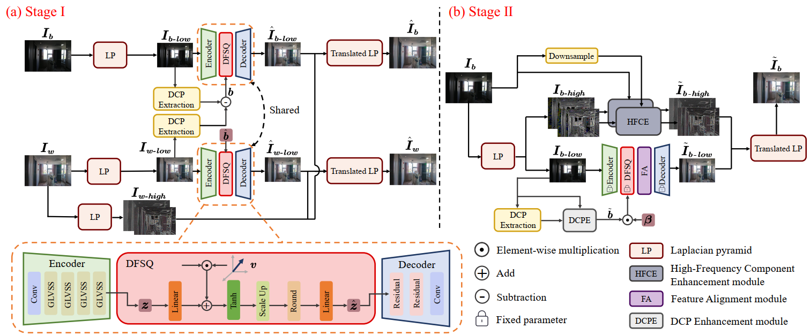

# Control-Lit: Illumination Controllable Backlit Image Enhancement
The official pytorch implementation of the paper Control-Lit: Illumination Controllable Backlit Image
Enhancement

## Framework

## Training
1. Run Train_st1.py 

2. Run Train_st2.py 

## Test
1. To perform default backlit image enhancement, run the Test.py file.

2. To perform controllable brightness backlit enhancement, run the Test_control.py file and provide a mask for the selected region of the image.

## Citation
If Control-Lit helps your research or work, please consider citing this paper.
```
@article{Control-Lit,
  title={Control-Lit: Illumination Controllable Backlit Image Enhancement}, 
  author={Wu, Hongjun and Tang, Yi and Li, Chongyi and Jin, Zhi},
   journal={IEEE Transactions on Circuits and Systems for Video Technology}, 
  year={2026},
  publisher={IEEE}
}
```

## Contact
If you have any questions, please contact [wuhj33@mail2.sysu.edu.cn](wuhj33@mail2.sysu.edu.cn)